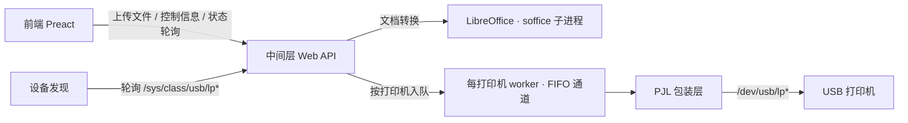

# Just Print


基于 Rust + Preact 构建的轻量打印机 Web 服务容器：容器内置 headless LibreOffice 将文档统一转换为 PDF，再通过 PJL 协议直接与 USB 打印机通信，不依赖 CUPS、驱动或其它系统组件。当前仅支持 Linux。

> 交付与部署只提供容器形态：镜像同时包含后端、前端静态文件、LibreOffice 与字体，从 GitHub Container Registry（GHCR）拉取，兼容 Docker 与 Podman。

## 特性

- 通过轮询 `/sys/class/usb/lp*` 发现打印机（含热插拔），从 sysfs 获取简要名称与序列号，默认选中第一台打印机
- 通过 PJL 查询打印机的完整能力，只暴露实用参数（双面/翻页、省墨、墨水浓度、纸张类型、打印分辨率等）
- 上传常见工作文档（DOCX / XLSX / PPTX / ODT / ODS / ODP / Markdown / 纯文本 / PDF），由镜像内置的 headless LibreOffice 统一转换为 PDF 并提供预览
- 同一台打印机的所有设备访问（打印 / 能力查询 / 复位）严格串行，任务按提交顺序 FIFO 执行
- 单令牌准入（Bearer）：不区分用户、无会话；TLS 由云网关 / 反向代理终结
- 前端采用 Gruvbox 配色，提供上传、预览、控制项和任务状态展示
- 交付为单一 OCI 镜像（`ghcr.io/niyueee/just-print`），前端静态文件由后端从镜像内目录提供，不再内嵌进二进制

## 架构

三层结构，职责分离：



| 层 | 职责 |
| --- | --- |
| PJL 包装层 | 轮询发现打印机、查询/解析/缓存 PJL 能力；只接收 PDF + 合法控制信息，执行打印 |
| 中间层 | 文件上传与临时存储、调用容器内 LibreOffice 转换为 PDF、预览、每打印机 worker 调度、Web API |
| 前端层 | 上传文件、展示预览、构建控制信息、展示任务状态（Gruvbox 风格） |

文档转换在容器内完成：镜像内置 `soffice --headless`（Writer / Calc / Impress 组件）与字体（`fonts-noto-cjk`、`fonts-liberation`），中间层以子进程方式调用，字节/文件进、PDF 出。

## 目录结构

```text
just-print/
├── Cargo.toml            # Rust 后端：axum + tokio + tower-http
├── src/
│   └── main.rs           # 后端入口：静态前端 + /healthz（业务 API 按路线图实现）
├── frontend/             # Preact + Vite + TypeScript 前端
│   ├── package.json
│   ├── vite.config.ts
│   └── src/
│       ├── main.tsx
│       ├── app.tsx
│       └── index.css
├── Containerfile         # 兼容 docker/podman 的多阶段镜像构建
├── examples/
│   ├── compose.yaml              # docker compose / podman-compose 示例
│   ├── just-print.container      # systemd Quadlet 示例
│   └── just-print.env.example    # Quadlet 环境文件示例
├── .github/workflows/
│   ├── ci.yml            # 检查链 + 镜像构建/冒烟测试 + compose 语法校验
│   └── release.yml       # tag 触发，构建并推送 GHCR 镜像
└── README.md
```

## 快速开始（容器部署）

镜像从 GHCR 直接拉取：`ghcr.io/niyueee/just-print:latest`；发布 tag（`v*`）后会同时提供 `ghcr.io/niyueee/just-print:vX.Y.Z`。

### Docker / Podman 直接运行

```bash
export JUST_PRINT_TOKEN="$(openssl rand -hex 32)"

docker run -d --name just-print -p 8080:8080 \
  -e JUST_PRINT_TOKEN="$JUST_PRINT_TOKEN" \
  ghcr.io/niyueee/just-print:latest

# 或 Podman：
podman run -d --name just-print -p 8080:8080 \
  -e JUST_PRINT_TOKEN="$JUST_PRINT_TOKEN" \
  ghcr.io/niyueee/just-print:latest
```

### Compose（docker compose / podman-compose）

```bash
export JUST_PRINT_TOKEN="$(openssl rand -hex 32)"
docker compose -f examples/compose.yaml up -d
podman-compose -f examples/compose.yaml up -d
```

### Podman Quadlet

按 [examples/just-print.container](examples/just-print.container) 顶部注释部署：

```bash
sudo mkdir -p /etc/containers/systemd /etc/just-print
sudo cp examples/just-print.env.example /etc/just-print/just-print.env
sudo chmod 600 /etc/just-print/just-print.env
sudoedit /etc/just-print/just-print.env   # 必须设置 JUST_PRINT_TOKEN（生成：openssl rand -hex 32）
sudo cp examples/just-print.container /etc/containers/systemd/
sudo systemctl daemon-reload
sudo systemctl enable --now just-print.service
```

### 本地构建镜像

```bash
just container

# 或手动指定：
docker build -f Containerfile -t ghcr.io/niyueee/just-print:local .
podman build -f Containerfile -t ghcr.io/niyueee/just-print:local .
```

## 部署与配置

### 环境变量

| 变量 | 默认值 | 说明 |
| --- | --- | --- |
| `JUST_PRINT_TOKEN` | 无 | 准入令牌，建议 32 字节以上随机值；未配置或为空时服务拒绝启动（fail-closed，待后端实现后生效） |
| `JUST_PRINT_ADDR` | `0.0.0.0:8080` | 后端监听地址；容器内直接对外监听，TLS 由云负载均衡 / Ingress / 反向代理终结 |
| `JUST_PRINT_WEB_DIR` | `/usr/share/just-print/web` | 前端静态文件目录（镜像内已内置，一般无需修改） |

### TLS 与访问控制

- 后端只提供 HTTP，证书在云网关（ALB / Ingress / Caddy / nginx 等）处终结，再转发到已发布的 8080 端口。
- 除健康检查外，`/api/*` 请求必须携带 `Authorization: Bearer <token>`（待后端实现）；不使用 Cookie 与会话，无 CSRF 问题。
- 前端将令牌保存在 `sessionStorage`，收到 401 时回到令牌输入页。

### USB 打印机透传

宿主机需要 Linux 内核 `usblp` 模块，且 `/dev/usb/lp*` 设备节点对容器可见（通常属于 `lp` 组）。容器运行时需映射设备节点：

- `docker run` / `podman run`：`--device /dev/usb/lp0:/dev/usb/lp0`
- Compose：取消 [examples/compose.yaml](examples/compose.yaml) 中 `devices:` 注释
- Quadlet：取消 [examples/just-print.container](examples/just-print.container) 中 `Device=` 注释

> 容器场景下热插拔能力有限：容器启动后新插入的设备节点需要宿主 udev 配合，重新创建/重启容器才能映射。

### 临时文件

文档转换使用容器内 `/tmp`。Compose 与 Quadlet 示例均将其挂为 `tmpfs`：容器重启即清空，避免残留。

## 本地检查与提交钩子

项目使用 [just](https://github.com/casey/just) 统一本地检查链：

- `just` / `just check`：后端 + 前端完整检查
- `just backend`：格式检查（fmt）+ 静态检查（clippy）+ 测试
- `just frontend`：依赖校验（frozen-lockfile）+ 类型检查 + 生产构建
- `just container`：用 podman 或 docker 构建本地镜像

首次克隆后执行一次以下命令，即可让每次 `git commit` 前自动运行 `just check`：

```bash
just init-hooks
```

钩子脚本位于 `.githooks/pre-commit`，随仓库一起维护；检查失败时提交会被中止。

## Web API 规划

最简 API；除健康检查外，所有接口都需要 Bearer 令牌：

| 方法 | 路径 | 说明 |
| --- | --- | --- |
| POST | `/api/files` | multipart 上传文件（字段 `file`），分配唯一 id 并转换为 PDF |
| GET | `/api/files/{id}` | 获取转换后的预览 PDF |
| GET | `/api/printers` | 获取打印机列表及合法控制信息 |
| POST | `/api/print` | 提交文件 id + 控制信息，入队并返回任务 id |
| GET | `/api/jobs/{id}` | 查询任务状态（排队中 / 打印中 / 成功 / 失败） |

任务与文件 id 仅存在于内存中：服务重启后均不再有效（请求返回 404），前端应提示「服务已重启，请重新上传」。

> 当前后端为 HTTP 骨架：已提供 `/healthz` 与静态前端服务，以上 API 按开发路线逐步实现。

## 支持的上传格式

中间层是格式的唯一入口：所有上传格式统一转换为 PDF 后，才交给 PJL 包装层。PJL 层只感知一个 PDF 字节流与合法控制信息，不感知原始格式。

| 格式 | 处理方式 |
| --- | --- |
| `.pdf` | 校验后原样通过 |
| `.docx` / `.xlsx` / `.pptx` | LibreOffice（soffice）转换为 PDF |
| `.odt` / `.ods` / `.odp` | LibreOffice（soffice）转换为 PDF |
| `.md` / `.txt` | LibreOffice（soffice）转换为 PDF |
| 其它（含 `.doc` / `.xls` / `.ppt`、`.html`、`.csv` 等） | 返回 415 |

转换在容器内临时目录完成；转换失败返回 `conversion_failed`，并清理临时文件。

## 文档转换

- 镜像内置 LibreOffice Writer / Calc / Impress 组件与 `fonts-noto-cjk`、`fonts-liberation`，无需在宿主机安装 LibreOffice。
- 中间层通过 `soffice --headless --convert-to pdf` 子进程转换，用信号量限制并发转换数量（CPU 密集操作）。
- 每个转换进程必须使用独立的用户配置目录（`-env:UserInstallation=file:///tmp/...`），仅靠信号量不足以避免并行 `soffice` 实例争用默认配置导致的锁冲突/偶发失败。
- 转换以容器内 LibreOffice 版本为准；与 Microsoft Office / WPS 的排版细节可能存在差异。
- 临时文件清理采用「引用计数 + TTL」：打印成功且无任务引用后移除；一直未被任务引用且超时的文件也会被清理。

## 并发与资源冲突处理

### 为什么按打印机排队，而不是全局队列

- `/dev/usb/lp*` 是字符设备，PJL 是「设置参数 → 发送数据 → 结束」的有状态会话。多个任务并发写入同一设备会互相穿插，导致参数错乱或输出损坏，因此同一台打印机必须串行化。
- 不同打印机之间没有资源冲突，可以并行；全局单队列会让空闲打印机不必要地等待。
- 队列放在中间层：PJL 包装层保持「一次执行一个设备会话」的简单语义，不负责调度。

### 每打印机 worker：互斥与顺序由结构保证

- 每台打印机对应一个独立后台 worker 与 FIFO 通道（`mpsc`）。任务提交时把命令写入对应通道并立即返回任务 id；worker 一次只取一个命令执行，**同一台打印机同时只存在一个设备会话**。
- 通道天然 FIFO：入队顺序即执行顺序。多客户端并发提交时，以服务端收到请求并登记的顺序为准。
- 不同打印机各自独立 worker，互不阻塞，可并行执行。

### 所有设备访问整体串行

- 不只打印任务需要串行：能力查询、设备复位同样是 PJL 会话，必须走同一台打印机的 worker，否则会把查询字节穿插进打印数据流。
- 能力查询是低频 init 操作：仅在设备被发现或热插拔时执行一次并缓存，不随每次打印重复查询；查询命令排在已排队的打印任务之后。
- 查询失败不阻塞服务启动：设备先标记为「能力未知」，随轮询周期自动重试，成功后出现在打印机列表中。

### 设备发现与热插拔

- 设备发现只读 `/sys/class/usb/lp*`（符号链接指向对应 USB 接口），并从 sysfs 读取 `product` / `manufacturer` / `serial`——这些字段不在 lp 节点自身，需沿 `device` 符号链接向上定位到 USB 设备目录读取；不调用 `lsusb`，不依赖 usbutils / udev。
- v1 固定每 5 秒轮询一次，与上次结果做 diff：新增设备 → 创建 worker 并查询能力；设备消失 → 失败相关任务并销毁 worker。
- 设备身份优先使用 sysfs `serial`；序列号缺失时回退到 lp 节点路径（此时路径变化会被识别为新设备，记入日志）。

### 失败、超时与复位

- 单个任务失败：标记为失败并继续执行队列中的下一个任务，**不自动重试**——打印是物理动作，自动重试可能重复出纸；用户手动重试时，新任务排在队尾。
- 设备会话带超时（v1 默认 60 秒，实现时计划改为可配置）：卡纸、离线等情况不能永久阻塞队列。
- 对 `/dev/usb/lp*` 的写可能是阻塞式的（设备停止接收数据时），超时不能只依赖 tokio 任务取消；实现时需用非阻塞 fd + poll 超时或分块写 + watchdog。
- 超时或失败导致设备状态未知时，下一次会话开始前先发送 PJL UEL（`\x1B%-12345X`）复位，避免残留参数影响后续任务。
- 打印过程中设备被拔走：正在打印的任务失败，该打印机队列中排队的所有任务也标记失败（原因：打印机已移除），worker 销毁；设备重新插入后按新发现处理并重新查询能力。

### 其它并发控制

- 文档转 PDF 是 CPU 密集操作，与打印机队列无关，用信号量限制并发转换数量。
- 临时文件清理需要避免误删仍被引用的文件：采用「引用计数 + TTL」。
- 打印任务入队后立即返回任务 id，前端通过轮询获取状态，避免长时间阻塞 HTTP 请求。

### 重启与持久化行为

- 服务运行在几乎不重启的本地环境：队列与任务状态保存在内存中，不做持久化。
- 进程重启会丢失未完成的任务，启动时清理孤儿临时文件；重启后未完成任务与已上传文件全部作废，前端对任务/文件 404 统一提示「服务已重启，请重新上传」，不做 404 与 410 的区分。

## 开发路线

- [x] 交付形态：Containerfile（docker/podman）、GHCR 发布、compose 与 Quadlet 示例
- [x] 后端 HTTP 骨架：静态前端 + `/healthz`
- [ ] PJL 包装层
  - [ ] 轮询 `/sys/class/usb/lp*` 发现设备（v1 固定 5 秒），读取 sysfs `product` / `manufacturer` / `serial`；默认选中第一台
  - [ ] 以 sysfs `serial` 维护设备身份，缺失时回退 lp 节点路径
  - [ ] 设备发现/热插拔时通过 PJL 查询能力并解析、缓存，仅保留实用参数：
    - 双面打印与翻页：`DUPLEX`、`BINDING`
    - 省墨模式：`ECONOMODE`
    - 墨水浓度：`DENSITY`
    - 纸张类型：`MEDIATYPE`
    - 打印分辨率：`RESOLUTION`
  - [ ] 严格校验 PDF 与控制信息，将 打印机名称 + 能力 传递给前端用于构建合法控制信息
  - [ ] 执行打印（一个 PDF + 一个合法控制信息），会话带超时；失败或超时后，下次会话前先发送 UEL 复位
- [ ] 中间层
  - [ ] 上传文件分配唯一 id，调用容器内 LibreOffice 统一转换为 PDF；文件临时存储
  - [ ] 预览：`GET /api/files/{id}` 直接返回 PDF，前端用浏览器查看器展示
  - [ ] 每打印机 worker + FIFO 通道：提交顺序即执行顺序，失败标记并继续，设备移除时失败队列任务
  - [ ] 实现 Bearer 令牌中间件（`JUST_PRINT_TOKEN`，常量时间比较，未配置或为空时拒绝启动）
  - [ ] 提供 Web API：上传、预览、能力查询、提交打印、任务状态
  - [ ] 临时文件清理（引用计数 + TTL）
- [ ] 前端层（采用 Gruvbox 配色）
  - [ ] 上传与预览
  - [ ] 打印机选择与实用控制项
  - [ ] 令牌输入与 `sessionStorage` 存储、401 处理
  - [ ] 任务状态展示（含服务重启导致的 404 提示）

## 设计约定

- 容器是唯一交付与部署方式：镜像内置后端、前端静态文件、LibreOffice 与字体；宿主机只需提供 Linux 内核 `usblp` 模块与设备节点权限。
- 不使用 CUPS、`lp`/`lpr` 或打印机驱动，也不依赖宿主机安装 usbutils / udev / LibreOffice。
- 打印机只接受 PDF：中间层用 LibreOffice 将上传格式统一转换为 PDF 后再交给 PJL 层，输出前严格校验。
- 单租户、无用户体系：准入仅依赖共享令牌 `JUST_PRINT_TOKEN`，不使用会话与 Cookie。
- 传输安全由云网关 / 反向代理负责：后端仅提供 HTTP，容器内默认监听 `0.0.0.0:8080`。
- 同一台打印机的所有设备访问（打印 / 能力查询 / 复位）严格串行，不同打印机可以并行。
- 能力查询仅在设备发现/热插拔时执行并缓存，不在每次打印时重复查询。
- 队列保存在内存中，重启后任务与临时文件作废；打印失败不自动重试，避免重复出纸。
- 后端启用严格 lint：`unsafe_code`、`panic`、`unwrap_used`、`indexing_slicing` 均为 deny，clippy 全量 pedantic deny，`missing_docs` deny。

## 已知限制

- 仅支持 Linux。
- 仅支持「支持的上传格式」列出的格式；旧版二进制格式（`.doc` / `.xls` / `.ppt`）不在 v1 范围。
- 文档转换以容器内 LibreOffice 为准，与 Microsoft Office / WPS 的排版可能存在差异。
- 第一版队列为内存队列，进程重启会丢失未完成任务。
- 无序列号打印机的身份依赖设备节点路径，拔插后路径变化会被识别为新设备。
- 热插拔期间正在打印或排队中的任务会失败，需要用户重新提交。
- 容器场景下 USB 热插拔依赖宿主 udev 与设备节点映射，能力有限。
- 设备会话固定 60 秒超时可能中断超大打印任务，v1 暂不可配置；实现时需同时设计阻塞式设备写入的超时/取消机制。

## 附录：PJL 打印字节流（设计约定）

一次打印会话按以下字节序列发送到 `/dev/usb/lp*`：

```text
\x1B%-12345X                      # UEL：进入 PJL 模式
@PJL SET DUPLEX=ON\r\n           # 控制信息，按能力查询结果生成
@PJL SET BINDING=LONGEDGE\r\n
@PJL ENTER LANGUAGE=PDF\r\n      # 切换到 PDF 语言
<PDF 原始字节流>
\x1B%-12345X                      # UEL：结束会话 / 复位
```

约定：

- 控制信息只允许使用能力查询返回的合法值；未查询到对应能力时不下发该参数。
- 部分打印机不支持 PDF personality（只支持 PCL / PostScript 等）：能力查询时应确认/记录 PDF 支持情况，不支持时将该设备标记为不可用并在前端提示，而不是发送后得到乱码。
- 能力查询、打印、复位都是完整 PJL 会话，必须由同一台打印机的 worker 串行执行。

## 附录：PJL 能力查询参考

```bash
printf "\x1B%%-12345X@PJL\r\n@PJL INFO VARIABLES\r\n\x1B%%-12345X" > /dev/usb/lp0
timeout 2 cat /dev/usb/lp0
```

示例输出（节选自真实打印机）：

```text
PORTRAIT
        LANDSCAPE
LPARM:IBM ORIENTATION=PORTRAIT [2 ENUMERATED]
        PORTRAIT
        LANDSCAPE
LPARM:EPSON ORIENTATION=PORTRAIT [2 ENUMERATED]
        PORTRAIT
        LANDSCAPE
LPARM:POSTSCRIPT ORIENTATION=PORTRAIT [2 ENUMERATED]
        PORTRAIT
        LANDSCAPE
LPARM:PCL FORMLINES=64 [2 RANGE]
        5
        128
LPARM:IBM FORMLINES=66 [2 RANGE]
        5
        128
LPARM:EPSON FORMLINES=66 [2 RANGE]
        5
        128
MANUALFEED=OFF [2 ENUMERATED]
        OFF
        ON
RESOLUTION=600 [6 ENUMERATED]
        300
        600
        900
        1200
        HQ1200
        TR1200
PERSONALITY=LABEL [5 ENUMERATED]
        PCL
        IBM
        EPSON
        POSTSCRIPT
        AUTO
AUTOCONT=ON [2 ENUMERATED]
        OFF
        ON
PASSWORD=DISABLED [2 RANGE]
        0
        65535
MEDIATYPE=REGULAR [14 ENUMERATED]
        REGULAR
        THICK
        THICK2
        THIN
        RECYCLED
        BOND
        ENVELOPES
        ENVTHICK
        ENVTHIN
        LABEL
        GLOSSY
        COLOR
        LETTERHEAD
        PREPUNCHED
ECONOMODE=ON [2 ENUMERATED]
        OFF
        ON
IMAGEADAPT=OFF [3 ENUMERATED]
        OFF
        ON
        AUTO
LPARM:PCL FONTSOURCE=I [1 ENUMERATED]
        I
LPARM:IBM FONTSOURCE=I [1 ENUMERATED]
        I
LPARM:EPSON FONTSOURCE=I [1 ENUMERATED]
        I
LPARM:PCL FONTNUMBER=97 [2 RANGE]
        0
        109
LPARM:IBM FONTNUMBER=97 [2 RANGE]
        0
        109
LPARM:EPSON FONTNUMBER=97 [2 RANGE]
        0
        109
LPARM:PCL PITCH=10.00 [2 RANGE]
        0.44
        99.99
LPARM:IBM PITCH=10.00 [2 RANGE]
        0.44
        99.99
LPARM:EPSON PITCH=10.00 [2 RANGE]
        0.44
        99.99
LPARM:PCL PTSIZE=12.00 [2 RANGE]
        4.00
        999.75
LPARM:IBM PTSIZE=12.00 [2 RANGE]
        4.00
        999.75
LPARM:EPSON PTSIZE=12.00 [2 RANGE]
        4.00
        999.75
DENSITY=0 [2 RANGE]
        -6
        6
HOLDKEY=0 [2 RANGE]
        0
        9999
RESOLUTIONX=600 [2 RANGE]
        300
        1200
RESOLUTIONY=600 [2 RANGE]
        300
        1200
CONTEXTSWITCH=ON [2 ENUMERATED]
        OFF
        ON
BINDING=LONGEDGE [2 ENUMERATED]
        LONGEDGE
        SHORTEDGE
DOWNFPROD=OFF [2 ENUMERATED]
        OFF
        ON
HOLD=OFF [3 ENUMERATED]
        OFF
        PROOF
        STORE
HOLDTYPE=PUBLIC [2 ENUMERATED]
        PUBLIC
        PRIVATE
DUPLEX=OFF [2 ENUMERATED]
        OFF
        ON
INTRAY1=UNLOCKED [2 ENUMERATED]
        UNLOCKED
        LOCKED
INTRAY2=UNLOCKED [2 ENUMERATED]
        UNLOCKED
        LOCKED
PRINTQUALITY=NORMAL [3 ENUMERATED]
        NORMAL
        DRAFT
        HIGH
LPARM:PCL SYMSET=PC8 [80 ENUMERATED]
        PC8
        PC8DN
        PC850
        PC852
        PC8TK
        PC1004
        WINL1
        WINL2
        WINL5
        WINBALT
        DESKTOP
        PSTEXT
        VNINTL
        VNUS
        MSPUBL
        MATH8
        PSMATH
        VNMATH
        PIFONT
        LEGAL
        ISO2
        ISO4
        ISO6
        ISO10
        ISO11
        ISO15
        ISO16
        ISO17
        ISO21
        ISO25
        ISO57
        ISO60
        ISO61
        ISO69
        ISO84
        ISO85
        WIN30
        HPGERM
        HPSPAN
        MCTEXT
        SYMBOL
        OCRA
        OCRB
        WDINGS
        HEBREW7
        ROMAN8
        ISOL1
        ISOL2
        ISOL5
        ISOL6
        PC775
        ABIBP
        ABIINTL
        RUSSIAN
        UKRAINIAN
        PC866
        PC8LG
        PC851
        WINGREEK
        ISOLC
        ISOGREEK
        PC853
        PC857
        PC858
        PC860
        PC861
        PC863
        PC869
        ISOL9
        PC8B
        PC8G
        PC8PC
        GREEK8
        TURKISH8
        ROMAN9
        ROMANEXT
        WINC
LPARM:IBM SYMSET=PC8 [8 ENUMERATED]
        PC8
        PC8DN
        PC850
        PC852
        PC860
        PC863
        PC865
        PC8TK
LPARM:EPSON SYMSET=USASCII [23 ENUMERATED]
        USASCII
        GERMAN
        UKASCII1
        FRENCH1
        ITALY
        SPANISH
        SWEDISH
        JAPANESE
        NORWEGIAN
        DANISH1
        DANISH2
        UKASCII2
        FRENCH2
        DUTCH
        SOUTHAFRICAN
        PC8
        PC8
```
