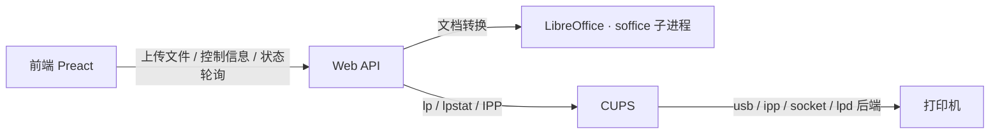

# Just Print


基于 Rust + Preact 构建的打印机 Web 服务容器：容器内置 CUPS、headless LibreOffice 与字体，上传的文档统一转换为 PDF 后交给 CUPS 打印，不再自行实现 PJL 会话和设备队列。当前仅支持 Linux。

> 交付与部署只提供容器形态：镜像同时包含后端、前端静态文件、CUPS、LibreOffice 与字体，从 GitHub Container Registry（GHCR）拉取，兼容 Docker 与 Podman。

## 特性

- 通过 CUPS 管理打印机：支持 driverless IPP（IPP Everywhere）、USB 与网络打印机，具体能力取决于 CUPS 后端与镜像内置配置。
- 只暴露 CUPS 提供的常见打印控制项（纸张、双面、打印质量、份数等），不再做自定义 PJL 能力查询，也不承诺适配仅支持私有 PJL 控制的老旧机型。
- 上传常见工作文档（DOCX / XLSX / PPTX / ODT / ODS / ODP / Markdown / 纯文本 / PDF），由镜像内置 headless LibreOffice 统一转换为 PDF 并提供预览。
- 打印任务由 CUPS 排队、执行与跟踪，API 只负责提交和查询状态。
- 单令牌准入（Bearer，常量时间比较，未配置令牌时 fail-closed 拒绝启动）：不区分用户、无会话；TLS 由云网关 / 反向代理终结。
- 前端采用 Gruvbox 配色，提供上传、预览、控制项和任务状态展示。
- 交付为单一 OCI 镜像（`ghcr.io/niyueee/just-print`），前端静态文件由后端从镜像内目录提供。

## 架构



| 层 | 职责 |
| --- | --- |
| Web API | 上传与临时存储、LibreOffice 转 PDF、打印机与选项枚举、任务提交和状态映射、Bearer 认证 |
| CUPS | 打印机发现与配置、过滤、队列调度、后端传输、作业状态 |
| 前端 | 上传文件、展示预览、构建 CUPS 选项、展示任务状态 |

## 目录结构

```text
just-print/
├── Cargo.toml            # Rust 后端：axum + tokio + tower-http
├── src/
│   ├── main.rs           # 后端入口：装配配置、CUPS 客户端与 HTTP 服务
│   ├── api/              # Web API：auth / files / printers / print / jobs
│   ├── cups/             # CUPS 集成：打印机枚举、选项读取、提交与任务查询
│   ├── config.rs         # 环境变量配置与 fail-closed 校验
│   ├── conversion.rs     # LibreOffice 文档转 PDF
│   ├── store.rs          # 临时文件与任务引用管理
│   └── error.rs / state.rs
├── frontend/             # Preact + Vite + TypeScript 前端
│   ├── package.json
│   └── src/
│       ├── api.ts              # API 封装与类型定义
│       ├── app.tsx / main.tsx  # 主界面与入口
│       ├── app.css / index.css # Gruvbox 配色与布局
│       └── components/         # TokenGate / Uploader / PrinterPanel / JobList
├── docs/
│   └── api.md           # Web API v1 详细契约
├── Containerfile         # 多阶段镜像构建（含 CUPS、LibreOffice、Ghostscript、字体）
├── container/
│   └── entrypoint.sh     # 拉起 CUPS、可选配置 cups-pdf 调试打印机与 IPP 发现
├── examples/             # compose / Quadlet / env 示例
├── .github/workflows/    # CI 与发布
└── README.md
```

## 快速开始（容器部署）

镜像从 GHCR 直接拉取：`ghcr.io/niyueee/just-print:latest`；发布 tag（`v*`）后会同时提供 `ghcr.io/niyueee/just-print:vX.Y.Z`。

### Docker / Podman 直接运行

```bash
export JUST_PRINT_TOKEN="$(openssl rand -hex 32)"

docker run -d --name just-print -p 8080:8080 \
  -e JUST_PRINT_TOKEN="$JUST_PRINT_TOKEN" \
  ghcr.io/niyueee/just-print:latest

# 或 Podman：
podman run -d --name just-print -p 8080:8080 \
  -e JUST_PRINT_TOKEN="$JUST_PRINT_TOKEN" \
  ghcr.io/niyueee/just-print:latest
```

使用 USB 打印机时，需要将 USB 设备目录映射进容器：

```bash
docker run -d --name just-print -p 8080:8080 \
  --device /dev/bus/usb:/dev/bus/usb \
  -e JUST_PRINT_TOKEN="$JUST_PRINT_TOKEN" \
  ghcr.io/niyueee/just-print:latest
```

### Compose（docker compose / podman-compose）

```bash
export JUST_PRINT_TOKEN="$(openssl rand -hex 32)"
docker compose -f examples/compose.yaml up -d
podman-compose -f examples/compose.yaml up -d
```

### Podman Quadlet

按 [examples/just-print.container](examples/just-print.container) 顶部注释部署：

```bash
sudo mkdir -p /etc/containers/systemd /etc/just-print
sudo cp examples/just-print.env.example /etc/just-print/just-print.env
sudo chmod 600 /etc/just-print/just-print.env
sudoedit /etc/just-print/just-print.env   # 必须设置 JUST_PRINT_TOKEN（生成：openssl rand -hex 32）
sudo cp examples/just-print.container /etc/containers/systemd/
sudo systemctl daemon-reload
sudo systemctl enable --now just-print.service
```

### 本地构建镜像

```bash
just container
```

## 部署与配置

### 环境变量

| 变量 | 默认值 | 说明 |
| --- | --- | --- |
| `JUST_PRINT_TOKEN` | 无 | 准入令牌，建议 32 字节以上随机值；未配置或为空时服务拒绝启动（fail-closed） |
| `JUST_PRINT_ADDR` | `0.0.0.0:8080` | 后端监听地址；容器内直接对外监听，TLS 由云负载均衡 / Ingress / 反向代理终结 |
| `JUST_PRINT_WEB_DIR` | `/usr/share/just-print/web` | 前端静态文件目录（镜像内已内置，一般无需修改） |
| `JUST_PRINT_CUPS_URI` | `http://127.0.0.1:631` | 容器内 CUPS 服务地址；一般无需修改 |
| `JUST_PRINT_CUPS_PDF` | `0` | 设为 `1` 时入口脚本自动添加 `CUPS-PDF` 调试打印机（cups-pdf，无真实打印机环境验证用） |
| `JUST_PRINT_DISCOVER_IPP` | `0` | 设为 `1` 时启动 mDNS/Avahi，并用 `ippfind` 自动添加局域网 IPP Everywhere 打印机 |

### 打印机配置

CUPS 在容器启动时由入口脚本拉起，打印机可以通过以下任一方式配置：

- 自动发现：使用 `ippfind` 发现局域网内的 IPP Everywhere 打印机，并以 `lpadmin -m everywhere` 添加。
- 显式配置：挂载自定义 CUPS 配置，或进入容器后用 `lpadmin` 指定打印机 URI 与 PPD，例如 `lpadmin -p printer -E -v ipp://... -m /path/to/ppd`。
- 调试：`JUST_PRINT_CUPS_PDF=1` 时入口脚本自动添加 `CUPS-PDF` 打印机，输出 PDF 到容器内 `/var/spool/cups-pdf/<用户名>`，适合没有真实打印机的 WSL 环境。
- 手动管理：进入容器后用 `lpadmin` / `lp` 自行管理。

只有 CUPS 中可见的打印机会出现在 `/api/printers`；前端控制项来自 `lpoptions -l` 与 IPP 属性，而不是 PJL 能力查询。

### TLS 与访问控制

- 后端只提供 HTTP，证书在云网关（ALB / Ingress / Caddy / nginx 等）处终结，再转发到已发布的 8080 端口。
- 除健康检查外，`/api/*` 请求必须携带 `Authorization: Bearer <token>`（常量时间比较）；不使用 Cookie 与会话，无 CSRF 问题。
- CUPS 默认只监听容器内部 `127.0.0.1:631`，不对外暴露。

### USB 设备透传

CUPS 的 `usb` 后端基于 libusb，容器需要映射 `/dev/bus/usb`；个别场景还需要 `/dev/usb/lp*` 设备节点。容器启动后新增的 USB 设备可能不会自动出现在映射中，通常需要按宿主机 udev 策略或重启容器。

### 临时文件

文档转换使用容器内 `/tmp`。Compose 与 Quadlet 示例均将其挂为 `tmpfs`：容器重启即清空，避免残留。

## 本地检查与提交钩子

项目使用 [just](https://github.com/casey/just) 统一本地检查链：

- `just` / `just check`：后端 + 前端完整检查
- `just backend`：格式检查（fmt）+ 静态检查（clippy）+ 测试
- `just frontend`：依赖校验（frozen-lockfile）+ 类型检查 + 生产构建
- `just container`：用 podman 或 docker 构建本地镜像
- `just debug`：构建并以 `JUST_PRINT_CUPS_PDF=1` 前台运行调试容器（需先设置 `JUST_PRINT_TOKEN`）

首次克隆后执行一次以下命令，即可让每次 `git commit` 前自动运行 `just check`：

```bash
just init-hooks
```

钩子脚本位于 `.githooks/pre-commit`，随仓库一起维护；检查失败时提交会被中止。

## Web API v1

最简 API；除健康检查外，所有接口都需要 Bearer 令牌：

| 方法 | 路径 | 说明 |
| --- | --- | --- |
| POST | `/api/files` | multipart 上传文件（字段 `file`），分配唯一 id 并转换为 PDF |
| GET | `/api/files/{id}` | 获取转换后的预览 PDF |
| GET | `/api/printers` | 获取 CUPS 打印机列表及 `lpoptions -l` 提供的合法控制项 |
| POST | `/api/print` | 提交文件 id + CUPS 选项，返回 CUPS 任务 id |
| GET | `/api/jobs/{id}` | 查询任务状态（queued / printing / completed / failed / canceled） |

上传文件仅存在于内存与临时目录中：服务重启后需重新上传；已进入 CUPS 队列的任务由 CUPS 按自身规则保留或重试。

所有错误响应统一为 `{"error": {"code": "...", "message": "..."}}`，完整契约见 [docs/api.md](docs/api.md)。

## 支持的上传格式

上传格式统一转换为 PDF 后提交给 CUPS；CUPS 根据驱动 / PPD 决定最终发送给打印机的语言（PDF、PostScript、PCL 或 raw）。

| 格式 | 处理方式 |
| --- | --- |
| `.pdf` | 校验后原样通过 |
| Word / Excel / PowerPoint（含旧版与模板） | LibreOffice（soffice）转换为 PDF |
| OpenDocument（Writer / Calc / Impress / Draw） | LibreOffice（soffice）转换为 PDF |
| 图片（PNG / JPG / WebP / TIFF / BMP / SVG 等） | LibreOffice（soffice）转换为 PDF |
| 文本与网页（Markdown / TXT / CSV / HTML / RTF 等） | LibreOffice（soffice）转换为 PDF |
| 其它 LibreOffice 可导入格式（共 172 种扩展名） | LibreOffice（soffice）转换为 PDF |

白名单与镜像内置 LibreOffice 7.4.7 注册的 `IMPORT` 过滤器一致（另保留
Markdown），完整扩展名列表见 [docs/api.md](docs/api.md)。

## 文档转换

- 镜像内置 LibreOffice Writer / Calc / Impress 组件与 `fonts-noto-cjk`、`fonts-liberation`，无需在宿主机安装 LibreOffice。
- 中间层通过 `soffice --headless --convert-to pdf` 子进程转换，用信号量限制并发转换数量。
- 每个转换进程使用独立的用户配置目录（`-env:UserInstallation=file:///tmp/...`），避免并行实例争用默认配置导致锁冲突。
- 转换以容器内 LibreOffice 版本为准；与 Microsoft Office / WPS 的排版细节可能存在差异。
- CUPS 侧的过滤、驱动与 PPD 决定最终打印输出，应用层不干预打印语言选择。

## 队列与失败语义

- 队列由 CUPS 管理：应用层不再实现每打印机 worker、FIFO 通道或设备会话互斥。
- 打印机离线时，任务按 CUPS 策略排队或挂起；重试、取消与超时行为由 CUPS 配置决定。
- 应用层不做自动重试，避免重复出纸；用户手动重试时通过 API 重新提交任务。
- 服务重启后，已上传的临时文件会丢失；CUPS 已接收的任务按 CUPS spool 配置处理。

## 设计约定

- CUPS 是唯一打印后端，不再自行实现 PJL 会话、设备发现或打印队列。
- 只暴露 CUPS / PPD / IPP 提供的常见选项，不为仅支持私有 PJL 控制的老旧机型做特殊适配。
- 单租户、无用户体系：准入仅依赖共享令牌 `JUST_PRINT_TOKEN`，不使用会话与 Cookie。
- 传输安全由云网关 / 反向代理负责；后端仅提供 HTTP。
- 容器是唯一交付与部署方式，宿主机只需提供 Linux 与必要的 USB/网络设备权限。
- 后端启用严格 lint：`unsafe_code`、`panic`、`unwrap_used`、`indexing_slicing` 均为 deny，clippy 全量 pedantic deny，`missing_docs` deny。

## 已知限制

- 仅支持 Linux。
- 仅支持「支持的上传格式」列出的 172 种扩展名；未列出的格式返回 `415`。
- 打印机兼容性取决于 CUPS 后端、驱动与 PPD；不支持 IPP Everywhere 且没有可用 PPD 的老式打印机可能无法提供控制项，或只能 raw 打印。
- 控制项仅限 CUPS 提供的常见选项，不再查询或透传打印机私有 PJL 变量（如省墨、墨浓度等）。
- 容器内 USB 热插拔能力有限，新增设备通常需要宿主 udev 配合或重启容器。
- CUPS 及依赖会显著增加镜像体积，并引入 cupsd、D-Bus、Avahi 等常驻组件。
- 局域网打印机自动发现依赖容器内 mDNS / Avahi 配置。

## 附录：常用 CUPS 命令

```bash
lpstat -p -l                                   # 查看打印机与状态
lpoptions -p PRINTER -l                        # 查看可用选项及合法值
lp -d PRINTER -o media=A4 -o sides=two-sided-long-edge file.pdf
lpstat -W not-completed -o PRINTER             # 查看未完成任务
cancel JOB_ID                                  # 取消任务
ippfind                                        # 发现 IPP Everywhere 打印机
```
