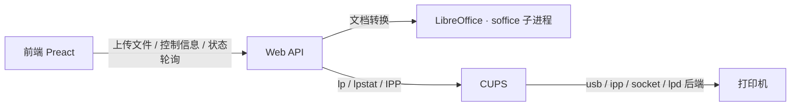

# 架构与实现

## 总体架构



| 层 | 职责 |
| --- | --- |
| Web API | 上传与临时存储、LibreOffice 转 PDF、打印机与选项枚举、任务提交和状态映射、Bearer 认证 |
| CUPS | 打印机发现与配置、过滤、队列调度、后端传输、作业状态 |
| 前端 | 上传文件、展示预览、构建 CUPS 选项、展示任务状态 |

## 目录结构

```text
just-print/
├── Cargo.toml            # Rust 后端：axum + tokio + tower-http
├── src/
│   ├── main.rs           # 后端入口：装配配置、CUPS 客户端与 HTTP 服务
│   ├── api/              # Web API：auth / files / printers / print / jobs
│   ├── cups/             # CUPS 集成：打印机枚举、选项读取、提交与任务查询
│   ├── config.rs         # 环境变量配置与 fail-closed 校验
│   ├── conversion.rs     # LibreOffice 文档转 PDF
│   ├── store.rs          # 临时文件与任务引用管理
│   └── error.rs / state.rs
├── frontend/             # Preact + Vite + TypeScript 前端
│   ├── package.json
│   └── src/
│       ├── api.ts              # API 封装与类型定义
│       ├── app.tsx / main.tsx  # 主界面与入口
│       ├── app.css / index.css # Gruvbox 配色与布局
│       └── components/         # TokenGate / Uploader / PrinterPanel / JobList
├── docs/
│   ├── api.md           # Web API v1 详细契约
│   ├── deployment.md    # 部署与配置
│   ├── architecture.md  # 本文档
│   └── development.md   # 本地开发与检查
├── Containerfile         # 多阶段镜像构建（含 CUPS、LibreOffice、Ghostscript、字体）
├── container/
│   └── entrypoint.sh     # 拉起 CUPS、可选配置 cups-pdf 调试打印机与 IPP 发现
├── examples/             # compose / Quadlet / env 示例
└── .github/workflows/    # CI 与发布
```

## 文档转换

- 镜像内置 LibreOffice Writer / Calc / Impress / Draw 组件与
  `fonts-noto-cjk`（中文）、`fonts-liberation`（西文）、`fonts-symbola`
  （表情符号单色字形）与 `poppler-utils`，无需在宿主机安装 LibreOffice。
- `.pdf` 只校验 `%PDF-` 魔数后原样通过，不重新转换。
- `.md` 先用 `pulldown-cmark` 解析并渲染为带打印样式的 `HTML`（标题、代码块、
  表格、引用等；原文中的原始 `HTML` 一律转义），再交给 `LibreOffice` 转换，
  避免以纯文本源码打印。为规避 `LibreOffice` 7.4 会吞掉正文首段的导入缺陷，
  渲染器会前置一个不可见的占位段落。
- 其它格式通过 `soffice --headless --convert-to pdf` 子进程转换。
- 白名单与镜像内置 LibreOffice 7.4.7 注册的 `IMPORT` 过滤器一致，另保留
  Markdown 与纯文本，共 172 个扩展名；完整列表见 [api.md](api.md)。
- 每个转换进程使用独立的用户配置目录
  （`-env:UserInstallation=file:///tmp/...`），避免并行实例争用默认配置导致锁
  冲突；同时用信号量限制最多 2 个并发转换。
- 单次转换默认超时 2 分钟；soffice 缺失、非零退出、超时或未生成有效输出时返回
  `422 conversion_failed`。
- 预览接口流式返回转换后的 PDF（`Content-Length` 已知），大文件不会整体载入
  内存。
- 转换以容器内 LibreOffice 版本为准；与 Microsoft Office / WPS 的排版细节可能
  存在差异。

## CUPS 集成

- 通过 `lpstat` / `lpoptions` / `lp` / `ipptool` 命令行工具与 CUPS 交互，应用层
  不实现 PJL 会话、设备发现或每打印机队列。
- 打印机与选项来自 `lpstat -p -l` 和 `lpoptions -p <printer> -l`，只暴露
  CUPS / PPD / IPP 提供的合法控制项。
- 任务通过 `lp -d <printer> -o key=value <pdf>` 提交，返回 `printer-job` 形式
  的任务 id。
- 状态查询通过 IPP `Get-Job-Attributes` 完成，映射为
  `queued` / `printing` / `completed` / `failed` / `canceled`。
- 入口脚本默认在启动时自动枚举 USB 打印机（`JUST_PRINT_AUTO_USB=1`），按型号
  匹配 PPD 并创建 CUPS 队列，找不到专用 PPD 时使用通用 PCL 兜底。
- CUPS 侧的过滤、驱动与 PPD 决定最终打印语言（PDF、PostScript、PCL 或 raw），
  应用层不干预。

## 队列与失败语义

- 队列由 CUPS 管理：应用层不实现每打印机 worker、FIFO 通道或设备会话互斥。
- 打印机离线时，任务按 CUPS 策略排队或挂起；重试、取消与超时行为由 CUPS 配置
  决定。
- 应用层不做自动重试，避免重复出纸；用户手动重试时通过 API 重新提交任务。
- 上传文件存放在容器内 `/tmp/just-print`，使用引用计数 + TTL 清理；服务重启后
  已上传的临时文件丢失，CUPS 已接收的任务按 CUPS spool 配置处理。

## 设计约定

- CUPS 是唯一打印后端，不再自行实现 PJL 会话、设备发现或打印队列。
- 只暴露 CUPS / PPD / IPP 提供的常见选项，不为仅支持私有 PJL 控制的老旧机型做
  特殊适配。
- 单租户、无用户体系：准入仅依赖共享令牌 `JUST_PRINT_TOKEN`，不使用会话与
  Cookie。
- 传输安全由云网关 / 反向代理负责；后端仅提供 HTTP。
- 容器是唯一交付与部署方式，宿主机只需提供 Linux 与必要的 USB/网络设备权限。
- 后端启用严格 lint：`unsafe_code`、`panic`、`unwrap_used`、`indexing_slicing`
  均为 deny，clippy 全量 pedantic deny，`missing_docs` deny。

## 已知限制

- 仅支持 Linux。
- 仅支持「支持的上传格式」列出的 172 种扩展名；未列出的格式返回 `415`。
- 打印机兼容性取决于 CUPS 后端、驱动与 PPD；不支持 IPP Everywhere 且没有可用
  PPD 的老式打印机可能无法提供控制项，或只能 raw 打印。
- 控制项仅限 CUPS 提供的常见选项，不再查询或透传打印机私有 PJL 变量（如省墨、
  墨浓度等）。
- 容器内 USB 热插拔能力有限，新增设备通常需要宿主 udev 配合或重启容器。
- CUPS 及依赖会显著增加镜像体积，并引入 cupsd、D-Bus、Avahi 等常驻组件。
- 局域网打印机自动发现依赖容器内 mDNS / Avahi 配置。
