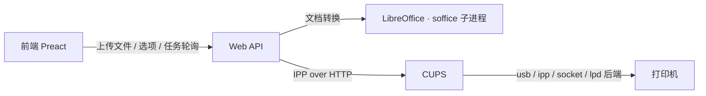

# 架构与实现

## 总体架构



| 层 | 职责 |
| --- | --- |
| Web API | 上传与临时存储、LibreOffice 转 PDF、打印机与选项枚举、幂等打印提交、任务查询/取消、Bearer 认证、指标 |
| CUPS | 打印机发现与配置、过滤、队列调度、后端传输、作业状态 |
| 前端 | 上传文件、展示预览、构建 IPP 选项、展示任务状态、取消/重打 |

## 目录结构

```text
just-print/
├── Cargo.toml            # Rust 后端：axum + tokio + tower-http + ipp
├── src/
│   ├── main.rs           # 入口：配置、状态、后台清理、HTTP 服务
│   ├── api/              # Web API
│   │   ├── mod.rs        # 路由装配、安全响应头
│   │   ├── auth.rs       # Bearer 常量时间校验
│   │   ├── middleware.rs # 请求 id/追踪 span、指标、请求超时
│   │   ├── files.rs      # 流式上传、PDF 预览、删除
│   │   ├── formats.rs    # 支持的扩展名（前后端单一来源）
│   │   ├── printers.rs   # 打印机与选项目录
│   │   ├── print.rs      # 幂等打印提交 + 失败对账
│   │   ├── jobs.rs       # 任务列表/查询/取消
│   │   └── health.rs     # /healthz、/readyz、/api/metrics
│   ├── cups/             # CUPS 集成（标准 IPP over HTTP）
│   │   ├── mod.rs        # CupsClient：枚举/选项/提交/查询/取消 + 缓存
│   │   └── options.rs    # 从 IPP 属性提取选项并编码为 job 属性
│   ├── config.rs         # 环境变量配置与 fail-closed 校验
│   ├── conversion.rs     # LibreOffice 文档转 PDF
│   ├── idempotency.rs    # Idempotency-Key 存储
│   ├── jobs.rs           # 应用层任务登记表
│   ├── metrics.rs        # Prometheus 指标注册表
│   ├── store.rs          # 临时文件引用计数 + TTL
│   ├── ids.rs            # CSPRNG id 生成
│   ├── error.rs          # 统一错误信封与状态码映射
│   └── state.rs          # AppState 与临时目录
├── frontend/             # Preact + Vite + TypeScript 前端
├── docs/                 # API / 架构 / 部署 / 开发文档
├── Containerfile         # 多阶段镜像构建
├── container/entrypoint.sh
├── examples/             # compose / Quadlet / env 示例
└── .github/workflows/    # CI 与发布
```

## 打印后端：标准 IPP over HTTP

- 后端通过 `ipp` crate 直接与 CUPS 通信，使用 RFC 8011 操作：
  `CUPS-Get-Printers`（枚举）、`Get-Printer-Attributes`（选项）、
  `Print-Job`（提交文档）、`Get-Job-Attributes` / `Get-Jobs`（查询）、
  `Cancel-Job`（取消）。应用层**不再**为每个请求 fork
  `lp` / `lpstat` / `lpoptions` / `ipptool` 子进程。
- 打印选项直接读 IPP 的 `*-supported` / `*-default` 属性（`media`、
  `sides`、`print-color-mode`、`print-quality`、`printer-resolution`、
  `copies`、`number-up`、`media-type`、`output-bin`、
  `orientation-requested`、`finishings`），编码为 `Print-Job` 的 job 模板属性，
  不使用 PPD / `lpoptions` 名称。
- 打印机快照带 10 秒 TTL 缓存 + singleflight 刷新；任务状态带 2 秒 TTL 缓存。
  前端轮询因此不会放大成 CUPS 请求风暴。
- IPP 层的超时、连接与协议错误被映射为 `503 service_unavailable` /
  `504 gateway_timeout` / `502 bad_gateway`，而不是笼统的 500。

## 幂等与失败语义

- `POST /api/print` 支持标准 `Idempotency-Key`：键 → 指纹 → 响应三元组保存在
  内存中（默认 10 分钟、容量 1024）。相同键与负载回放响应并标记
  `Idempotency-Replayed`；并发重复返回 `409` + `Retry-After`；键被复用于不同
  负载返回 `409`。
- 提交时把幂等键的短标记写入 IPP `job-name`（`<文件名> [xxxxxxxx]`）。若
  `Print-Job` 超时/连接失败（响应可能已丢失），后端会先按标记 `Get-Jobs`
  对账找回任务，再决定是否允许重试，避免重复出纸。
- 应用层不做自动重试；用户手动重试时复用同一幂等键（前端负责保持键稳定）。
- 队列由 CUPS 管理；打印机离线时任务按 CUPS 策略排队或挂起。取消通过
  `DELETE /api/jobs/{id}`。
- 上传文件存放在容器内 `/tmp/just-print`，使用引用计数 + TTL 清理；服务重启后
  临时文件丢失，CUPS 已接收的任务仍在其 spool 中。

## 文档转换

- 镜像内置 LibreOffice 组件、`fonts-noto-cjk`、`fonts-liberation`、
  `fonts-symbola`、`poppler-utils`。
- `.pdf` 只校验 `%PDF-` 魔数后原样通过。
- `.md` 先用 `pulldown-cmark` 渲染为带打印样式的 HTML（原始 HTML 一律转义），
  再交给 LibreOffice；为规避 LibreOffice 7.4 吞首段的导入缺陷，渲染器前置一个
  不可见占位段落。
- 其它格式通过 `soffice --headless --convert-to pdf` 转换，信号量限制并发
  （`JUST_PRINT_CONVERSION_SLOTS`，默认 2），单次超时
  `JUST_PRINT_CONVERSION_TIMEOUT_SECS`（默认 120 秒）。
- 每个转换进程使用独立 `UserInstallation` 目录，避免并行实例争用配置锁。

## 可观测性

- 每个请求有 `x-request-id`（可透传）并建立带该 id 的追踪 span；打印提交写审计
  日志（请求 id、任务 id、打印机、文件名、选项）。
- `/api/metrics` 暴露 Prometheus 指标：HTTP 请求计数/耗时直方图、
  IPP 操作计数、上传/转换/打印结果计数、上传文件数与字节数、任务登记数等。
- `/healthz` 是存活探针，`/readyz` 会真实查询 CUPS。

## 安全设计

- 准入仅依赖共享令牌 `JUST_PRINT_TOKEN`（常量时间比较，scheme 大小写不敏感），
  无会话与 Cookie。
- 前端令牌存于 `sessionStorage`，不写入 URL；PDF 预览用 blob URL，避免把令牌
  放进查询串。
- 所有响应带 `nosniff`、`Referrer-Policy: no-referrer`、`X-Frame-Options: DENY`
  与 CSP；`/api` 响应 `no-store`。
- 文件 id 使用 CSPRNG（UUID v4）。
- 传输安全由云网关 / 反向代理负责；后端仅提供 HTTP。
- 严格 lint：`unsafe_code`、`panic`、`unwrap_used`、`indexing_slicing` 均 deny，
  clippy 全量 pedantic deny，`missing_docs` deny。

## 已知限制

- 仅支持 Linux；容器是唯一交付与部署方式。
- 仅支持 `GET /api/formats` 列出的扩展名；未列出的格式返回 `415`。
- 打印机兼容性取决于 CUPS 后端、驱动与 PPD；不支持 IPP Everywhere 且没有可用
  PPD 的老式打印机可能无法提供控制项，或只能 raw 打印。
- 幂等键、任务登记表与上传文件都在内存/临时盘中，服务重启后丢失；CUPS 中的
  任务仍可查询。
- CUPS 及依赖会显著增加镜像体积，并引入 cupsd、D-Bus、Avahi 等常驻组件。
- 局域网打印机自动发现依赖容器内 mDNS / Avahi 配置。
